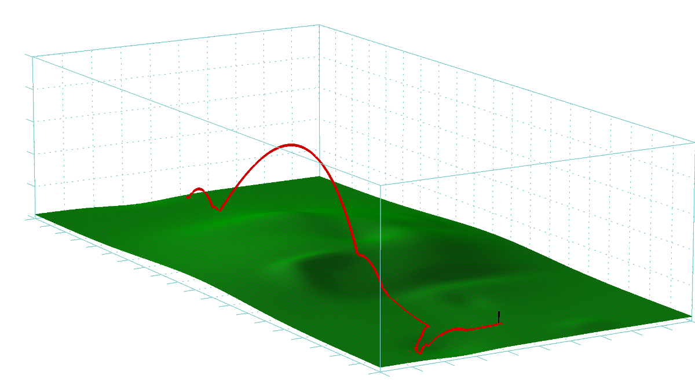

# World of particles in a fluid (or the game of golf)

The purpose of this project was to implement a simple golf simulator that would include most of the relevant physics such as viscous damping forces and Magnus force, with different contact detection models used for both collision response and simulation termination. Advanced level tasks were to include friction and effects of spin on motion, effects of a moving fluid velocity, collisions with a non-planar terrain height field and development of a model for dissipative for angular velocity decay.

